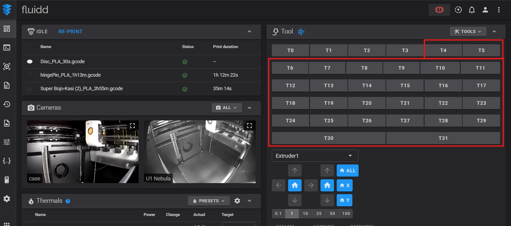
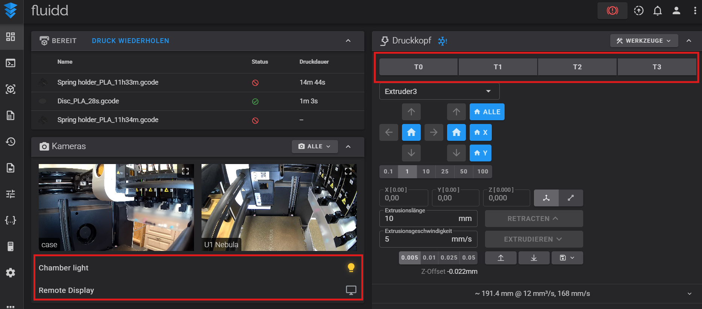
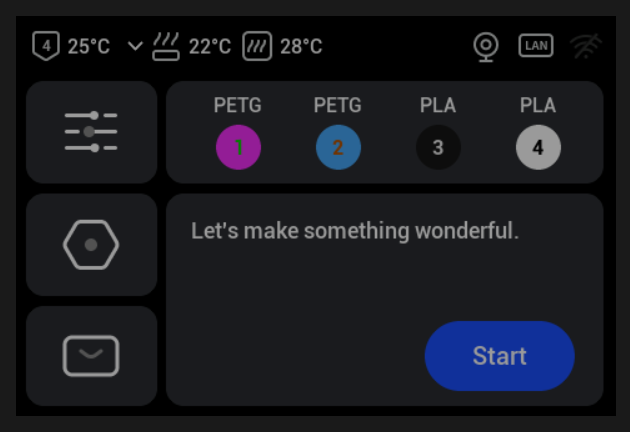

# Snapmaker U1 improvements (Fluidd) – persistent UI tweaks

> **Reboot-safe UI modification for Snapmaker U1 (Fluidd)**  
> Adds a **Chamber light toggle** and **Remote Display access** below the Cameras card  
> and hides unused toolheads (T4–T31).

---

## What this repository is about

This repository provides a **persistent UI modification** for the **Snapmaker U1 running Fluidd**.

It focuses on two goals:

- **Easy installation for beginners** (one copy & paste via SSH)
- **Full transparency for advanced users** (documented file system layout and source files)

You do **not** need to understand the internal files to use this tweak.

---

## For beginners (recommended)

If you just want the feature:

- **Use the `copy-paste/` folder**
- Copy **one single script**
- Paste it into an SSH session
- Done

➡️ **No Git, no file copying, no manual editing required**

All required files are created automatically on the printer.

Detailed step-by-step instructions can be found here:
[copy-paste/README.md](https://github.com/TinkerBarn/Snapmaker-U1-improvements/blob/550514ec841a3afe5723382e686b4d8fde89f795/copy-paste/README.md)


---

## For advanced users / documentation 🔧

The folder below documents **exactly which files are created on the printer** and **where they are stored**:

```
filesystem/
```

This folder mirrors the real Snapmaker U1 file system paths, for example:

- `/etc/init.d/S99u1-ui-tweaks`
- `/home/lava/printer_data/misc/u1-ui-tweaks/custom.js`
- `/home/lava/printer_data/misc/u1-ui-tweaks/custom.css`

➡️ These files are **automatically created** when you use the copy & paste installer.  
➡️ Nothing inside `filesystem/` needs to be copied manually.

---

## ⚠️ Not stock firmware – prerequisites

This tweak **does NOT work with the stock Snapmaker U1 firmware**.

It requires the **Paxx12 Snapmaker U1 Extended Firmware**, which provides:

- SSH access
- Persistent storage
- Remote Screen feature

Documentation and downloads:
https://github.com/paxx12/SnapmakerU1-Extended-Firmware

Remote Screen feature:
https://github.com/paxx12/SnapmakerU1-Extended-Firmware/blob/main/docs/remote_screen.md

---

## What the tweak does

- **Toolchanger UI**
  - Shows only **T0–T3**
  - Hides unused toolheads **T4–T31**

- **Cameras card**
  - Adds **Chamber light** ON/OFF button  
    (controls LED: `cavity_led`)
  - Adds **Remote Display** button  
    Opens: `http://<printer-ip>/screen/`

- **Persistent**
  - Survives reboots and power cycles
  - Uses a late `init.d` boot hook

---

## Screenshots
- Standard fluidd view with 32 Tool heads


- Improved fluidd view with 4 Tool heads,
Chamber light button and remote screen button under camera streams


- Remote screen in browser


---

## License
MIT
