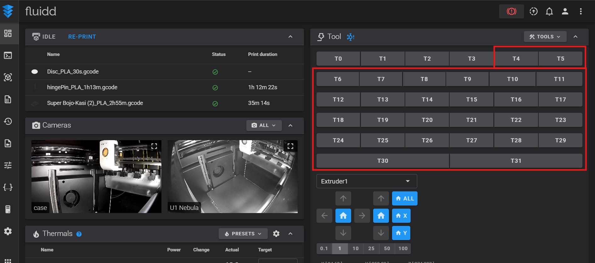
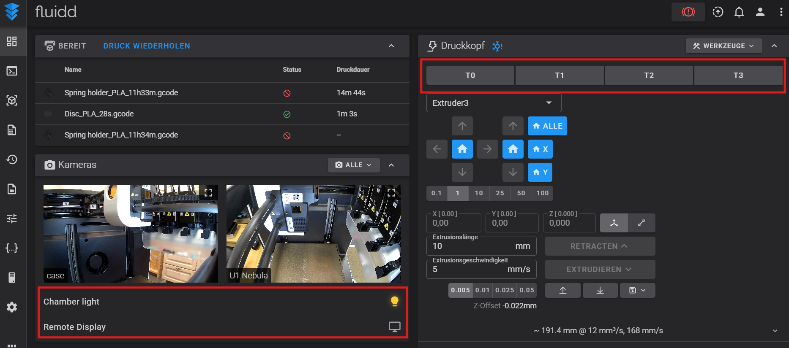
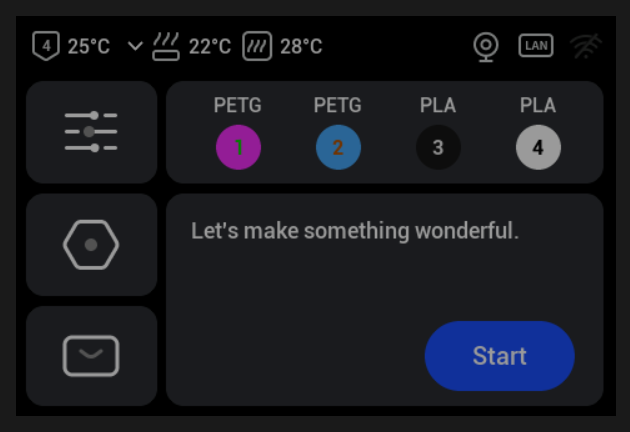

# Snapmaker U1 improvements for Fluidd

This repository adds small but useful buttons and cleanup tweaks to the Fluidd web interface on the Snapmaker U1.

The goal is simple: Fluidd should be easier to use on the U1. You do not need to know Linux, Git, or Klipper internals to install the beginner version.

---

## What changes after installation?

Fluidd is the web interface you open in your browser to control the printer.

These tweaks can add:

- A **Chamber Light** button directly in Fluidd
- A **Remote Screen** button that opens the printer screen in your browser
- An optional **Firmware Config** button
- An optional **Top Cover LED** button
- A cleaner toolchanger area that shows only the useful U1 toolheads instead of many unused entries

The benefit: common controls are easier to find, and the Fluidd page looks less confusing.

---

## Which version should I choose?

There are three copy & paste installers. Choose only one.

### Version A: Chamber Light + Remote Screen

Installer file:

```text
chamber-light_remote-display
```

Choose this if you want the safest and simplest version.

It adds:

- Chamber Light button
- Remote Screen button
- Cleaner toolchanger view

### Version B: Chamber Light + Remote Screen + Firmware Config

Installer file:

```text
chamber-light_remote-display_firmware-config
```

Choose this if you also want a quick button to open the Paxx12 Firmware Config page.

It adds everything from Version A plus:

- Firmware Config button

### Version C: Chamber Light + Top Cover LED + Remote Screen + Firmware Config

Installer file:

```text
chamber-light_top-cover-light_remote-display_firmware-config
```

Choose this only if you also want to control an extra LED strip in a Top Cover.

It adds everything from Version B plus:

- Top Cover LED button

Important hardware note:

- A physical **Top Cover** should be installed.
- You also need to build or install an **LED strip with a cable connection** to the rear upper connector on the printer.
- Without this additional hardware, the Top Cover LED button is not useful.

---

## Required first: Paxx12 Extended Firmware

These tweaks do **not** work with the original stock Snapmaker U1 firmware.

Install the latest **Paxx12 Snapmaker U1 Extended Firmware** first:

https://github.com/paxx12-snapmaker-u1/SnapmakerU1-Extended-Firmware/releases/latest

Paxx12 installation guide:

https://snapmakeru1-extended-firmware.pages.dev/install

After installing Paxx12, enable SSH as described in the Paxx12 documentation:

https://snapmakeru1-extended-firmware.pages.dev/ssh_access

---

## What is SSH?

SSH is a way to open a command window on the printer from your computer.

You only need it to paste the installer text once.

- On **Windows**, you can use a terminal or an SSH tool.
- On **macOS**, you can use the Terminal app or another SSH tool.

The exact SSH setup is documented by Paxx12:

https://snapmakeru1-extended-firmware.pages.dev/ssh_access

---

## Beginner installation

Use the instructions in:

[copy-paste/README.md](https://github.com/TinkerBarn/Snapmaker-U1-improvements/blob/main/copy-paste)

Short version:

1. Install Paxx12 Extended Firmware.
2. Enable SSH.
3. Open an SSH connection to the printer.
4. Open one installer file from the `copy-paste/` folder.
5. Copy the complete text.
6. Paste it into the SSH window and press Enter.
7. Reload Fluidd with Ctrl + F5.
8. Reboot the printer.

You do not need Git. You do not need to copy files manually.

Before a future firmware update, it is recommended to remove the `.debug` file and reboot the printer:

```sh
rm /oem/.debug
reboot
```

After a successful firmware update, run the Copy & Paste installation once again.

---

## Advanced documentation

The folders `filesystem/` and `Fluidd/` are mainly for advanced users who want to inspect what the installer creates or change things manually.

Beginners should use the `copy-paste/` installer instead.

---

## Screenshots

Standard Fluidd view with many unused toolheads:



Improved Fluidd view with useful U1 controls:



Remote screen in browser:



---

[](https://ko-fi.com/H2H41XBKJ6)

---

## License

MIT
